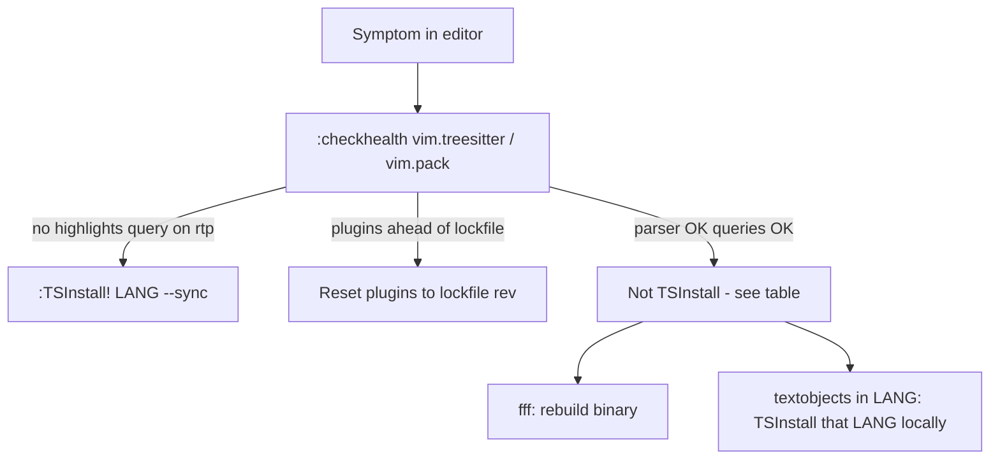

# Neovim error diagnostics cheat sheet

Dotfiles sync via git. Local Neovim state in `~/.local/share/nvim/` does **not**.
After `git pull` on a new machine or a Neovim upgrade, run checks in order:
`checkhealth vim.pack` → `checkhealth vim.treesitter` → `:TSInstall!` only for what's missing.



## Quick decision tree

| First thing you notice | One-line clue in trace or check | Fix |
|---|---|---|
| Flat/no color | `queries/LANG/highlights.scm` not on rtp | `:TSInstall! LANG --sync` |
| `:checkhealth vim.pack` errors | "not at expected revision" | Reset plugins to lockfile (not TSInstall) |
| fff search fails | `fff` + `usize` / `fuzzy_search_files` | Re-download fff binary |
| `]f` crashes in one language | `textobjects/move.lua` + that filetype | `:TSInstall! that-lang --sync` |
| Markdown only, conceal_line | `injections` + plugin rev drift | Reset nvim-treesitter to lockfile |

## Rule of thumb: is it TSInstall?

**TSInstall is needed when** `~/.local/share/nvim/site/queries/LANG/` or
`~/.local/share/nvim/site/parser/LANG.so` is missing for a language you care about.

**TSInstall is NOT needed when:**

- Stack trace names `fff`, `vim.pack`, or `conceal_line` + `injections` with plugins out of sync
- `:checkhealth vim.pack` is clean and queries show OK for that language

---

## 1. No syntax color at all (e.g. Go looked plain white)

**What you see:** No errors necessarily — just flat text. Treesitter may still "work" silently.

**The giveaway (not in the error):**

```vim
:echo empty(vim.api.nvim_get_runtime_file('queries/go/highlights.scm', true))
" → 1 means NO highlight query on runtime path
```

Or:

```vim
:checkhealth vim.treesitter
```

Look for your language under **Treesitter queries** — if `highlights` is missing or not
under `~/.local/share/nvim/site/queries/LANG`, that's the problem.

**Why the stack trace misleads:** There often isn't one. Parser can exist
(`:echo vim.treesitter.get_parser():lang()` → `go`) while queries are absent. Neovim
disables vim `syntax` when treesitter attaches, so you get **zero** highlighting.

**Fix:** `:TSInstall! go --sync` (installs parser **and** symlinks queries into
`~/.local/share/nvim/site/queries/`)

---

## 2. Markdown / conceal_line crash

**What you see:**

```
Decoration provider "conceal_line" (ns=nvim.treesitter.highlighter):
attempt to call method 'range' (a nil value)
  ... query_predicates.lua:141
  ... _get_injections
```

**The giveaway:** File type matters — happens on **markdown with fenced code blocks**,
not on Go. Stack mentions `injections` / `conceal_line` / `set-lang-from-info-string!`.

**Why it's NOT obviously TSInstall:** The trace points at nvim-treesitter query code,
not "parser missing."

**What it actually was:** Plugin **git rev drift** (machine had newer `nvim-treesitter`
than `nvim-pack-lock.json`), not missing parsers.

**Giveaway check:**

```vim
:checkhealth vim.pack
" → ERROR Plugin "nvim-treesitter" is not at expected revision
```

**Fix:** Reset local plugins to lockfile revs — **not** TSInstall.

---

## 3. fff file search crash

**What you see:**

```
Failed to search files: bad argument #3: error converting Lua nil to usize
  ... fff/file_picker/init.lua:72
  ... fuzzy_search_files
```

**The giveaway:** Plugin name **`fff`** in the stack, and **`usize`** (Rust/Lua FFI
boundary). Nothing about treesitter, queries, or parsers.

**Why it's NOT TSInstall:** Native Rust binary bundled with fff.nvim — separate subsystem.

**Giveaway check:** Compare binary age vs plugin commit:

```bash
stat ~/.local/share/nvim/site/pack/core/opt/fff.nvim/target/release/libfff_nvim.so
git -C ~/.local/share/nvim/site/pack/core/opt/fff.nvim rev-parse HEAD
# Binary months older than plugin = API mismatch
```

**Fix:**

```vim
:lua require('fff.download').download_or_build_binary()
```

The `PackChanged` hook in `lua/plugins/fff.lua` does this on normal install/update;
manual `git checkout` of the plugin skips it.

---

## 4. `]f` / textobjects error in one language (e.g. Dart)

**What you see:**

```
attempt to perform arithmetic on local 'score' (a nil value)
  ... nvim-treesitter-textobjects/move.lua:86
  ... goto_next_start
  ... treesitter.lua:47
```

**The giveaway:** Stack ends in **`nvim-treesitter-textobjects/move.lua`** and your
keymap in `lua/plugins/treesitter.lua`. Triggered by **`]f`** (or `[f`, `]c`, etc.),
not on buffer open.

**Why it's misleading:** Looks like a textobjects bug. Real cause: **no parser for that
language locally**; the plugin returns `{}` when there's no parser, Lua treats it as
truthy, then `range[6]` is nil.

**Giveaway checks:**

```vim
:echo vim.treesitter.language.get_lang('dart')
:echo empty(vim.api.nvim_get_runtime_file('parser/dart.so', true))  " → 1 = no parser
```

**Fix:** `:TSInstall! dart --sync` locally. Other machines may already have the parser
installed by hand — no dotfile change required.

---

## New machine setup (one-time, in Neovim)

```vim
:checkhealth vim.pack
:TSInstall! go lua python javascript typescript hurl --sync
:lua require('fff.download').download_or_build_binary()
```

Add any other languages you use (e.g. `dart`) to the TSInstall line as needed.
See also the comment block in `~/.config/Brewfile` under `brew "neovim"`.
